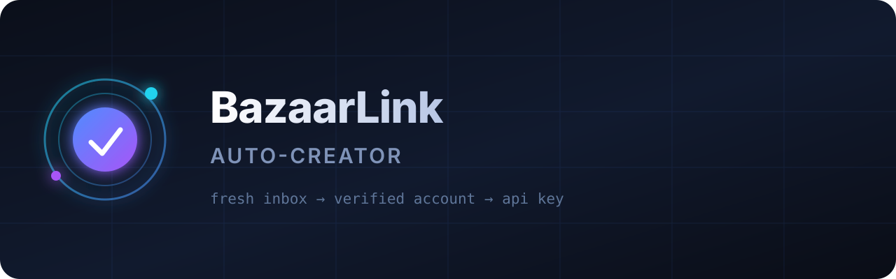

<div align="center">



<br>

**Crea una cuenta de BazaarLink y su primera clave API de extremo a extremo con un solo comando.**

[](../LICENSE)
[](https://nodejs.org)
[](https://playwright.dev)
[](#-requisitos)
[](../CONTRIBUTING.md)
[](https://github.com/fauzihub13/bazaarlink-auto-creator/stargazers)

**🌐 Idiomas:**
[English](../README.md) ·
[Bahasa Indonesia](README.id.md) ·
[日本語](README.ja.md) ·
[简体中文](README.zh.md) ·
[Español](README.es.md)

</div>

---

## ✨ Descripción

**BazaarLink Auto-Creator** es un script de automatización de extremo a extremo que crea una cuenta
de [BazaarLink](https://bazaarlink.ai) y su primera clave API sin pasos manuales.

En cada ejecución:

1. Crea una **bandeja de entrada desechable nueva** en [tempmail.cloud](https://tempmail.cloud) — sin registro, reutilizable.
2. Genera una **identidad aleatoria** (nombre realista + contraseña aleatoria fuerte).
3. Se registra en BazaarLink y resuelve el desafío **Cloudflare Turnstile** en un navegador real.
4. Lee el **código de verificación de 6 dígitos** de la bandeja y verifica la cuenta.
5. Crea una **clave API con nombre aleatorio** y guarda todo en un archivo JSON.

Está diseñado para ejecutarse sin supervisión en un VPS: un comando y obtienes una clave lista.

## 🚀 Inicio rápido

```bash
git clone https://github.com/fauzihub13/bazaarlink-auto-creator.git
cd bazaarlink-auto-creator
npm install                 # instala Playwright + Chromium

node cli.mjs                # crear 1 cuenta
node cli.mjs --count 5      # crear 5 cuentas, secuencialmente
node cli.mjs --headful      # mostrar el navegador (depuración / Turnstile manual)
node cli.mjs --out keys.json
```

Los resultados se escriben en `results.json` (o `--out <archivo>`):

```json
[
  {
    "ok": true,
    "name": "Chloe Harper",
    "email": "clear.b6cb1a@inbox.rtxsty.online",
    "password": "Panther-Cobalt-4821",
    "mailboxPassword": "T!BpXX20A8U_Aa9",
    "apiKey": "sk-bl-IT3JVJzWNHe2l40ppF1GMPhx4Gui7du8xlpWcxKs3dT06_xG",
    "keyName": "Production Key",
    "baseUrl": "https://api.bazaarlink.ai/v1",
    "createdAt": "2026-09-28T03:39:20.569Z"
  }
]
```

Usa la clave con cualquier cliente compatible con OpenAI:

```bash
curl https://api.bazaarlink.ai/v1/chat/completions \
  -H "Authorization: Bearer sk-bl-..." \
  -H "Content-Type: application/json" \
  -d '{"model":"deepseek-v4-flash","messages":[{"role":"user","content":"hola"}]}'
```

## 🧩 Cómo funciona

```
┌──────────────┐   ┌──────────────────┐   ┌─────────────────┐   ┌──────────────┐
│ tempmail.cloud│ → │ Registro BazaarLink│ → │ Leer código 6   │ → │ Crear clave   │
│ bandeja nueva │   │ + Turnstile       │   │ dígitos          │   │ (nombre rand) │
└──────────────┘   └──────────────────┘   └─────────────────┘   └──────────────┘
```

| Paso | Mecanismo |
| --- | --- |
| Bandeja | `POST https://tempmail.cloud/api/mailboxes` → `{ email, token, password }` |
| Registro | Chromium real vía Playwright, rellena el formulario y resuelve Turnstile |
| Verificación | Se consulta `GET https://tempmail.cloud/api/messages` hasta recibir el código |
| Clave API | `POST https://bazaarlink.ai/api/v1/keys` usando las cookies de sesión |

## 📁 Estructura del proyecto

```
bazaarlink-auto-creator/
├── cli.mjs              # punto de entrada CLI (flags, lotes, salida)
├── package.json
├── src/
│   ├── creator.mjs      # flujo completo (Playwright + HTTP)
│   ├── tempmail.mjs     # cliente de bandeja desechable + extracción de código
│   └── random.mjs       # nombres, contraseñas y etiquetas de clave aleatorias
├── assets/
│   ├── logo.svg
│   └── icon.svg
└── docs/
    ├── README.id.md
    ├── README.ja.md
    ├── README.zh.md
    └── README.es.md
```

## ⚙️ Requisitos

- **Node.js 18+**
- ~1 GB de disco libre para el navegador Chromium
- Una IP de salida que Cloudflare Turnstile acepte (ver la nota abajo)

### Bibliotecas del sistema Ubuntu / Debian

Chromium necesita varias bibliotecas compartidas. En un VPS mínimo, instálalas una vez:

```bash
sudo apt-get update
sudo apt-get install -y libglib2.0-0 libnss3 libnspr4 libdbus-1-3 libatk1.0-0 \
  libatk-bridge2.0-0 libcups2 libdrm2 libxkbcommon0 libxcomposite1 libxdamage1 \
  libxfixes3 libxrandr2 libgbm1 libpango-1.0-0 libcairo2 libasound2 fonts-liberation
```

> En Ubuntu 24.04 el paquete se llama `libasound2t64`. Si no encuentras un paquete, búscalo con
> `apt-cache search <nombre>`.

## 🔌 Configuración

| Flag | Por defecto | Descripción |
| --- | --- | --- |
| `--count <n>` | `1` | Número de cuentas a crear |
| `--headful` | desactivado | Muestra la ventana del navegador |
| `--out <archivo>` | `results.json` | Dónde escribir los resultados |

Uso como módulo:

```js
import { createAccount } from "./src/creator.mjs";

const account = await createAccount({ headless: true });
console.log(account.apiKey);
```

`createAccount` también acepta `executablePath` (usar un Chrome del sistema), `timeoutMs` y `keepOpen`.

## ⚠️ Importante: Cloudflare Turnstile y reputación de IP

BazaarLink protege **tanto el registro como el inicio de sesión** con Cloudflare Turnstile. En una IP
de centro de datos / nube mal valorada por Cloudflare, el widget devuelve *"Verification failed"* y el
flujo no puede completarse. Es un **límite de reputación de IP, no un fallo del script**.

- ✅ Funciona mejor en un VPS residencial / de oficina o en un equipo de escritorio.
- 🖥️ Usa `--headful` para ver el navegador y completar el desafío a mano si es necesario — el script
  espera el token y continúa automáticamente.
- 🔁 Si Turnstile falla ocasionalmente, vuelve a ejecutar; es intermitente.

## 🛡️ Seguridad y ética

- **La clave API se muestra una sola vez** — el script la captura y la guarda en `results.json`. Protege ese archivo.
- `results.json`, `.env*` y otros archivos sensibles están ignorados por git por defecto.
- Úsalo solo para cuentas que estés autorizado a crear y conforme a los términos de servicio de BazaarLink.

## 🤝 Contribuir

¡Las contribuciones son bienvenidas! Lee [CONTRIBUTING.md](../CONTRIBUTING.md) y abre un issue o PR.

## 📄 Licencia

Publicado bajo la [Licencia MIT](../LICENSE). Copyright original © 2026 0xgetz (XHI); fork mantenido por [fauzihub13](https://github.com/fauzihub13).

<div align="center"><sub>Creado para el ecosistema de pasarelas de IA compatibles con OpenAI.</sub></div>
